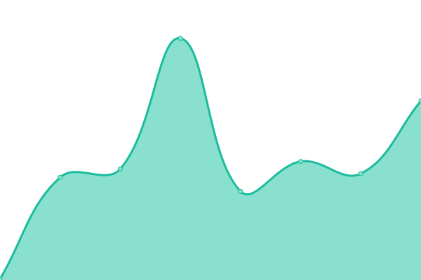
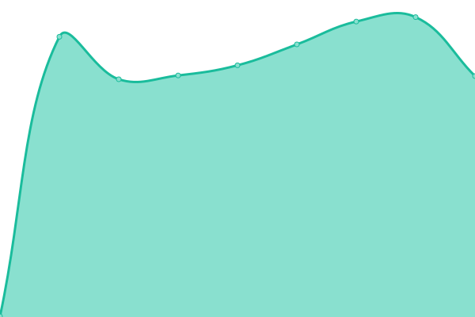
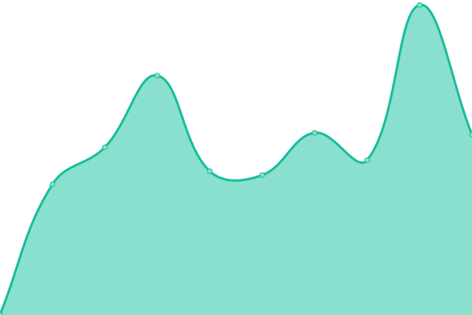

# [📈 Live Status](https://status.eosc-synergy.eu): <!--live status--> **🟧 Partial outage**

This repository contains the open-source uptime monitor and status page for [Project EOSC-synergy](www.eosc-synergy.eu), powered by [Upptime](https://github.com/upptime/upptime).

With [Upptime](https://upptime.js.org), you can get your own unlimited and free uptime monitor and status page, powered entirely by a GitHub repository. We use [Issues](https://github.com/eosc-synergy/status/issues) as incident reports, [Actions](https://github.com/eosc-synergy/status/actions) as uptime monitors, and [Pages](https://status.eosc-synergy.eu) for the status page.

<!--start: status pages-->
<!-- This summary is generated by Upptime (https://github.com/upptime/upptime) -->
<!-- Do not edit this manually, your changes will be overwritten -->
<!-- prettier-ignore -->
| URL | Status | History | Response Time | Uptime |
| --- | ------ | ------- | ------------- | ------ |
|  [SQAaaS Web](https://sqaaas.eosc-synergy.eu/) | 🟩 Up | [sq-aaa-s-web.yml](https://github.com/EOSC-synergy/status/commits/master/history/sq-aaa-s-web.yml) | 

 155ms
     
 | 

<a href="https://eosc-synergy.github.io/status/history/sq-aaa-s-web">100.00%</a>
    

|  [SQAaaS API - production](https://api.sqaaas.eosc-synergy.eu/v1/) | 🟩 Up | [sq-aaa-s-api-production.yml](https://github.com/EOSC-synergy/status/commits/master/history/sq-aaa-s-api-production.yml) | 

 998ms
     
 | 

<a href="https://eosc-synergy.github.io/status/history/sq-aaa-s-api-production">99.42%</a>
    

|  [SQAaaS API - staging](https://api-staging.sqaaas.eosc-synergy.eu/v1/) | 🟩 Up | [sq-aaa-s-api-staging.yml](https://github.com/EOSC-synergy/status/commits/master/history/sq-aaa-s-api-staging.yml) | 

 439ms
     
 | 

<a href="https://eosc-synergy.github.io/status/history/sq-aaa-s-api-staging">100.00%</a>
    

|  [SQAaaS API - development](https://api-dev.sqaaas.eosc-synergy.eu/pipeline) | 🟩 Up | [sq-aaa-s-api-development.yml](https://github.com/EOSC-synergy/status/commits/master/history/sq-aaa-s-api-development.yml) | 

 435ms
     
 | 

<a href="https://eosc-synergy.github.io/status/history/sq-aaa-s-api-development">100.00%</a>
    

|  [Jenkins](https://jenkins.eosc-synergy.eu/) | 🟥 Down | [jenkins.yml](https://github.com/EOSC-synergy/status/commits/master/history/jenkins.yml) | 

 670ms
     
 | 

<a href="https://eosc-synergy.github.io/status/history/jenkins">100.00%</a>
    

<!--end: status pages-->

[**Visit our status website →**](https://status.eosc-synergy.eu)

## 📄 License

- Powered by: [Upptime](https://github.com/upptime/upptime)
- Code: [MIT](./LICENSE) © [Project EOSC-synergy](www.eosc-synergy.eu)
- Data in the `./history` directory: [Open Database License](https://opendatacommons.org/licenses/odbl/1-0/)
